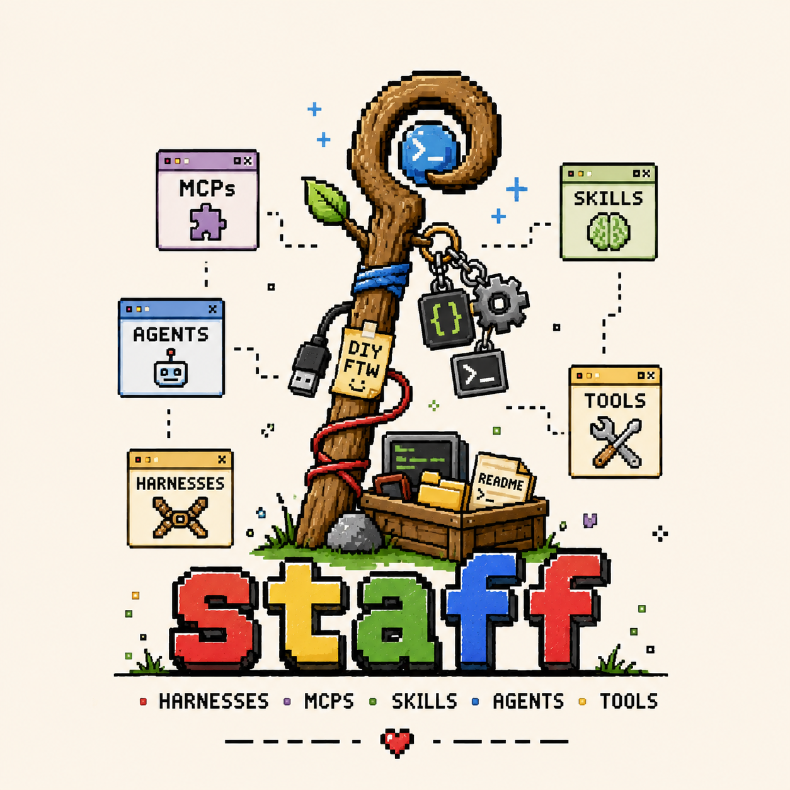

<p align="center">
  
</p>

<h3 align="center">AI tooling monorepo</h3>

<p align="center">
  A personal collection of harnesses, MCP servers, skills, agents, and tools<br/>
  for building with LLMs across providers and languages.
</p>

---

## Quick start

```bash
git clone <repo-url>
cd staff
./setup.sh
```

`setup.sh` links the `staff` CLI into `~/.local/bin`, creates state at `~/.staff/`, and builds the project registry. Requires `jq` and `git`.

## CLI

```bash
staff list                          # List all projects
staff add_source <name> <path>      # Register and auto-install an external project
staff init <category> <name>        # Scaffold a new project
staff install <project>             # Wire it into Claude Code
staff uninstall <project>           # Remove an installed project
staff build <project>               # Build a project
staff doctor                        # Check installation health
staff registry rebuild              # Regenerate registry.json
```

Categories: `skill`, `mcp`, `agent`, `tool`, `harness`, `lib`

## Layout

| Directory    | What goes here                                                                  |
| ------------ | ------------------------------------------------------------------------------- |
| `harnesses/` | AI orchestration harnesses and frameworks                                       |
| `mcps/`      | MCP server implementations                                                      |
| `skills/`    | Claude Code skill definitions (`.md` frontmatter files)                         |
| `agents/`    | Agent definitions and multi-agent workflows                                     |
| `tools/`     | Standalone CLI tools and utilities                                              |
| `lib/`       | Shared libraries used by multiple projects                                      |
| `sources/`   | Source bundles for external repos, each with a repo symlink and source metadata |
| `templates/` | Scaffolding templates for `staff init`                                          |

## Projects

| Project                   | Category | Language | Status | Description                                                                        |
| ------------------------- | -------- | -------- | ------ | ---------------------------------------------------------------------------------- |
| [`sdlc`](harnesses/sdlc/) | harness  | Python   | alpha  | AI-powered SDLC orchestration — plan, architect, implement, verify, review, refine |

### SDLC harness

The first project in the repo. A Python CLI for AI-powered development lifecycle orchestration with a hybrid engine (direct API for thinking phases, `claude` CLI for doing phases), multi-provider support (Anthropic, OpenAI, Google), composable phases, and file-based state.

```bash
cd harnesses/sdlc && pip install -e .
sdlc init --prompt "description"      # Start a cycle
sdlc plan / architect / tasks / ...   # Run individual phases
sdlc run                              # Run full sequence with approval gates
sdlc status                           # Show progress
```

## Adding external projects

You can register external repos (from organizations, communities, or your own separate projects) into `staff` to ingest them as read-only dependencies, exposing whatever skills/agents/tools live inside so they're immediately usable. The repo is never written to — `staff add_source` only ever symlinks it in and rebuilds the registry.

```bash
# Register a staff-native external repo (has its own staff.json manifests)
staff add_source sdlc-fork /path/to/external-repo/harnesses/sdlc --no-install

# Register a plain external repo — no staff.json required. staff recognizes
# each category's own native format: SKILL.md for skills (Claude Code's own
# skill convention), and agent-frontmatter .md files under agents/.
staff add_source anthropic_skills /path/to/anthropics/skills

# Review sourced projects
staff list --sourced true

# Install later if you skipped auto-install
staff install pdf

# Rebuild the registry manually only when you need to rescan changes
staff registry rebuild

# Inspect the source bundle metadata
cat sources/anthropic_skills/source.toml
ls -l sources/anthropic_skills/repo
```

`add_source` first tries the repo's own `staff.json` manifests, if any. For anything else, it recognizes native formats per category — currently **skill** (`SKILL.md`) and **agent** (flat `<name>.md` with `name:`/`description:` frontmatter under `agents/`). For each match it synthesizes a `staff.json` under `sources/<name>/generated/`, pointing back at the real file inside the read-only `sources/<name>/repo/` symlink — the source repo itself is never modified. MCP and tool auto-discovery isn't supported yet (no single unambiguous native-format signal); a source repo that already ships real `staff.json` files for those still works via the manifest path.

Either way, `add_source` records source metadata (including git SHA when available), rebuilds the registry, and auto-installs by default so every discovered project is ready immediately.

## Project structure

Each project is self-contained with its own deps, build, and a `staff.json` manifest:

```
<category>/<project-name>/
  staff.json      # Metadata, build config, install config
  README.md
  src/
  package.json | pyproject.toml | go.mod | Cargo.toml
```

The combined index lives at `registry.json` in the repo root. Run `staff registry rebuild` to regenerate it.

## How install works

| Category | `staff install` action                         |
| -------- | ---------------------------------------------- |
| skill    | Symlinks into `~/.claude/skills/`              |
| mcp      | Merges config into Claude Code `settings.json` |
| agent    | Symlinks into `~/.claude/agents/`              |
| tool     | Creates wrapper script in `~/.local/bin/`      |

## Adding a new project

```bash
staff init <category> <name> [--lang ts|python|go]
```

Or manually: create the directory, add `staff.json` and a README, then run `staff registry rebuild`.
